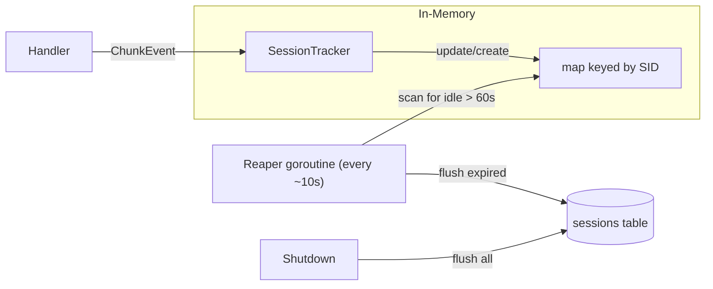

# In-Memory Session Tracking

## Current Architecture

Each chunk request is individually written to the `requests` hypertable via a batch worker pool (`chunklog.Writer`). The handler sends a `ChunkEvent` per chunk to a channel, workers batch them, and `COPY` into the DB.

## New Architecture




- **SessionTracker** replaces `chunklog.Writer`. Same `Send(ChunkEvent)` interface so handler changes are minimal.
- **Session map**: `map[uuid.UUID]*Session` protected by `sync.Mutex`. At 5k-10k entries this is trivially small.
- **Reaper**: a background goroutine that periodically scans the map, finds sessions where `time.Since(LastActive) > 60s`, removes them from the map and writes them to the DB.
- **Shutdown**: flushes all remaining sessions before closing the DB pool.

## Session struct

Stored in memory per active session:

- `SID`, `UID` (uuid.UUID)
- `StartTime`, `LastActive` (time.Time)
- `TotalBytes` (int64)
- `Codec` (Codec), `Quality` (ChunkQuality) — from first chunk filename
- `IP` (net.IP), `Referer` (string) — from first request
- All UA fields — parsed once from first request's User-Agent

On each chunk event for an existing session: update `LastActive`, add to `TotalBytes`.

## Database Schema

Replace `scripts/sql/001_init.sql` — the `requests` table becomes a `sessions` table:

```sql
CREATE TABLE IF NOT EXISTS sessions (
    sid                   UUID              NOT NULL,
    uid                   UUID              NOT NULL,
    start_time            TIMESTAMPTZ       NOT NULL,
    end_time              TIMESTAMPTZ       NOT NULL,
    total_bytes           BIGINT            NOT NULL DEFAULT 0,
    codec                 SMALLINT,
    quality               SMALLINT,
    ip                    INET,
    referer               VARCHAR(255),
    -- UA fields (same set as current)
    ua_browser            VARCHAR(255),
    ...
);
```

This is a regular table (not a hypertable) since session writes are infrequent.

## Files to Change

1. `**[internal/chunklog/events.go](internal/chunklog/events.go)**` — Add `Session` struct. Simplify or remove `DBEvent` / `BatchBuffer` / `chunkRequestColumns`. Keep `ChunkEvent`, `parseEvent` logic for IP/UUID/UA/codec parsing, but refactor it into a helper that populates a `Session` on first event.
2. `**[internal/chunklog/writer.go](internal/chunklog/writer.go)**` — Replace `Writer` with `SessionTracker`:
  - Same `Send(ChunkEvent) bool` non-blocking interface (reuse channel pattern).
  - Single goroutine reads from channel, updates map (no contention — single writer).
  - Reaper timer inside the same goroutine (or separate goroutine scanning the map under a lock).
  - `flush()` writes expired sessions to DB via `INSERT` (batch if multiple expire at once).
  - `Shutdown(ctx)` drains channel, flushes all sessions.
3. `**[internal/chunklog/batchbuffer.go](internal/chunklog/batchbuffer.go)**` — Remove or replace with a simpler batch insert helper for sessions.
4. `**[internal/hserv/handler.go](internal/hserv/handler.go)**` — Rename `ChunkWriter` field to `SessionTracker` (or keep the interface name). The `Send()` call stays the same.
5. `**[internal/hserv/hserv.go](internal/hserv/hserv.go)**` — Update field type and `Shutdown` call.
6. `**[cmd/hserv/hserv.go](cmd/hserv/hserv.go)**` — Update flag docs (remove `batch`/`batchTimeout`/`workers` flags, add `sessionTimeout` flag). Create `SessionTracker` instead of `Writer`.
7. `**[scripts/sql/001_init.sql](scripts/sql/001_init.sql)**` — Replace with sessions table schema.

## Design Decisions

- **Single goroutine vs mutex-guarded map**: Using a single goroutine that owns the map (reads from the event channel and runs the reaper on a timer) avoids locking entirely. This is the cleanest approach and handles 10k sessions easily.
- **Reaper interval**: ~10 seconds. At 10k sessions, iterating the map is sub-millisecond.
- **DB writes**: Simple `INSERT` (or batched `COPY` if many sessions expire at once). Since sessions end at a much lower rate than individual chunk requests, this is not a bottleneck.
- **Graceful shutdown**: Close channel, drain remaining events into map, flush all sessions to DB, close pool.

